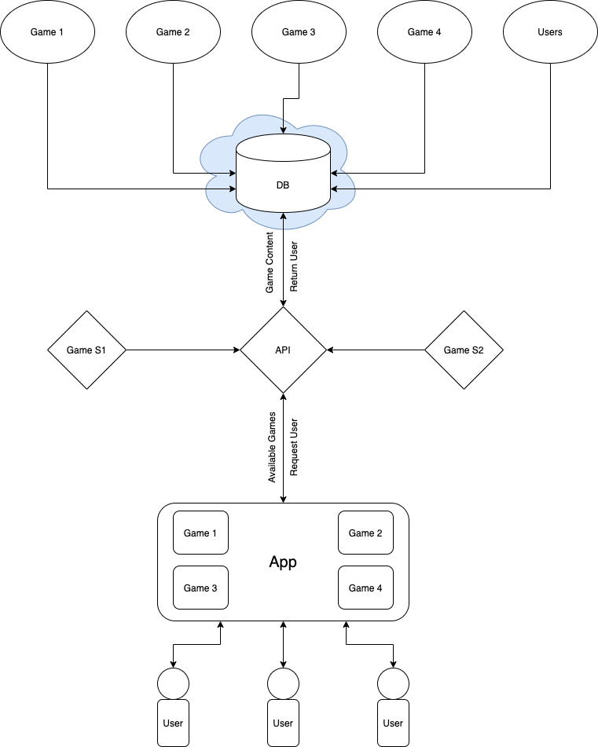

### Socially Distant

Fun app with assortment of group based games that can be done whilst video chatting. This will undoubtedly contian multiple games and thus should be acrchitected in a a way that adding or removing a game should be as pain and bug free as possible.

#### App

This contains the mobile application code and is what the user interfaces with. I've gone for simplicity using expo. It will most likely spin up a login and selection page will serve as the content barrier and lock unlock content based on user purchases.

#### Api

This will likely be powered by graphql and node and will be dealing with firestore or another google offering of the like.
This will return requested games, user profiles and permissions to the app.

#### Systems Design

This outlies the general thinking of how the systems will interact with one another.

#### Games

##### Friend something something

Randomly generated quuestion are asked to a group of firends who then answer them, the questions are designed to encourage amusing answers.

Requirements:

##### V1

- User must login (instagram, facebook, etc).
- User should have profile (pic, etc).
- Should support 2 to many additional users in a game.
- Users will be able to vote on answers.
- There should be a points system to win.
- Should be able to easly scale.

##### V2

- Users should be abel to upload answers to social media.
- Users should be able to submit their own questions and they should be stored for future use.
